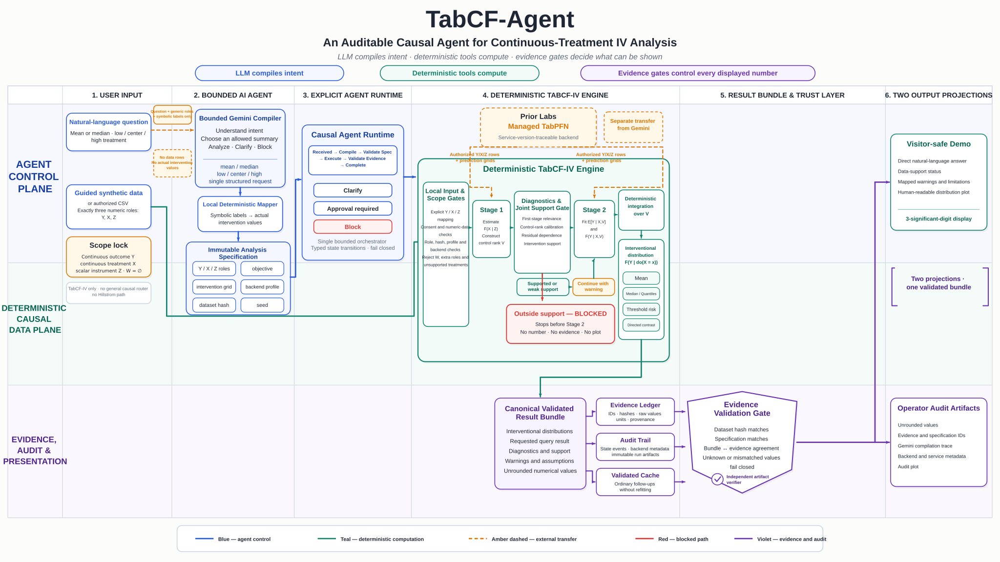

<h1 align="center">TabCF-Agent</h1>

<p align="center">
  <strong>An auditable causal agent for continuous-treatment distributional IV analysis</strong>
</p>

<p align="center">
  <a href="https://arxiv.org/abs/2605.05993"></a>
  <a href="https://github.com/GepingChen/TabCF"></a>
  
  
</p>

<p align="center">
  <a href="https://huggingface.co/spaces/GPChen01/dcfa-zerogpu"><strong>Live ZeroGPU demo</strong></a>
  ·
  <a href="https://gepingchen.github.io/projects/dcfa/"><strong>Prepared demo</strong></a>
  ·
  <a href="https://colab.research.google.com/github/GepingChen/DCFA/blob/main/notebooks/DCFA_Custom_Analysis_Colab.ipynb"><strong>Open in Colab</strong></a>
  ·
  <a href="https://arxiv.org/abs/2605.05993"><strong>Read the paper</strong></a>
</p>

**TabCF-Agent** (implemented here as the `dcfa` package) is the agentic system
built on the method introduced in our arXiv paper,
**[TabCF: Distributional Control Function Estimation with Tabular Foundation
Models](https://arxiv.org/abs/2605.05993)**. The paper introduces TabCF for
distributional control-function estimation; this repository adds a bounded agent
layer that compiles natural-language questions, runs deterministic causal tools,
checks diagnostics and support, and binds every displayed number to verifiable
evidence.

> **LLMs compile intent. Deterministic tools compute. Evidence gates decide what
> can be shown.**

<p align="center">
  <a href="plots/tabcf_agent_overview_4k.png">
    
  </a>
</p>

<p align="center"><sub>Click the architecture figure to open the 4K version. The editable SVG and deterministic generator are in <a href="plots/">plots/</a>.</sub></p>

## Why TabCF-Agent?

Many causal-agent demos blur together language-model reasoning, statistical
estimation, and presentation. TabCF-Agent keeps those responsibilities separate:

1. **A bounded compiler** turns a natural-language request into an immutable,
   typed analysis specification. Gemini sees symbolic treatment labels and the
   Y/X/Z role contract—not data rows or actual intervention values.
2. **An explicit runtime** validates roles, state transitions, approvals, and
   failures. Unsupported requests fail closed instead of silently changing the
   estimand or model.
3. **Deterministic TabCF-IV tools** perform every numerical calculation, from
   control-function construction to interventional distributions, means,
   quantiles, risks, and directed contrasts.
4. **An evidence and audit layer** binds results to data and specification hashes,
   versions, support status, warnings, unrounded values, and source artifacts.
   An independent verifier checks the saved bundle without refitting.

## Supported analysis

The public workflow intentionally supports one causal design:

| Role | v1 contract |
|---|---|
| Outcome `Y` | One continuous outcome |
| Treatment `X` | One continuous treatment |
| Instrument `Z` | One scalar instrument |
| Baseline covariates `W` | None; non-empty `W` is rejected before Stage 1 |

Within that scope, the agent can return interventional means, medians and other
quantiles, threshold risks, and directed contrasts. It preserves weak-IV and
support warnings, blocks interventions outside joint support before Stage 2, and
serves ordinary follow-ups from a validated cache rather than refitting.

It is **not** a general causal-method router, an IV-discovery system, an
invalid-instrument repair tool, or an autonomous policy-deployment system.
Empirical diagnostics do not prove instrument validity or identification.

## Try the project

Choose the path that matches what you want to inspect:

| Path | What happens | Providers and data boundary |
|---|---|---|
| **[Live ZeroGPU demo](https://huggingface.co/spaces/GPChen01/dcfa-zerogpu)** | Runs authenticated presets or a bounded Y/X/Z CSV with pinned local TabPFN v2 | Presets make no provider call; temporary-key CSV sends only the question to Gemini; development-only |
| **[Prepared demo](https://gepingchen.github.io/projects/dcfa/)** | Replays one hash-bound, independently verified synthetic result | Static GitHub Pages; no provider call at view time |
| **[Colab workflow](https://colab.research.google.com/github/GepingChen/DCFA/blob/main/notebooks/DCFA_Custom_Analysis_Colab.ipynb)** | Runs one bounded custom CSV analysis in your own ephemeral runtime | Your question goes to Google; only separately authorized Y/X/Z rows and prediction grids go to Prior Labs |
| **Local operator demo** | Runs the guided Gradio workflow and preserves full audit artifacts | Uses your repository-external Gemini and TabPFN Client credentials |

The ZeroGPU, Colab, and local managed-service paths are `development_only`. Provider
availability, quotas, charges, and Colab resources are not guaranteed. Do not use
sensitive, confidential, personally identifiable, or otherwise unshareable data.

### Local setup

Clone the pinned TabCF submodule and install the core development environment:

```bash
git clone --recurse-submodules https://github.com/GepingChen/DCFA.git
cd DCFA
python3.11 -m venv .venv
.venv/bin/python -m pip install -r requirements-dev.lock
.venv/bin/python -m pip install -e . --no-deps
```

Run a credential-free mechanics demo:

```bash
.venv/bin/dcfa tabcf-demo \
  --scenario strong_iv \
  --output-dir artifacts/local/tabcf-strong-v1
```

This command explicitly uses the local
`sklearn_quantile_fallback`. Its output is `development_only`, is **not a TabCF
result**, and cannot enter locked Track T evidence.

To run the managed website demo, install the combined environment and place both
credentials outside the repository:

```bash
.venv/bin/python -m pip install -r requirements-website-demo.lock
.venv/bin/python -m pip install -e . --no-deps
chmod 600 ~/.config/dcfa/gemini_api_key
chmod 600 ~/.config/dcfa/tabpfn_api_key
.venv/bin/dcfa-website-demo
```

Open `http://127.0.0.1:7860`. See
[`docs/WEBSITE_DEMO.md`](docs/WEBSITE_DEMO.md) for credential setup, readiness
checks, Docker/Compose operation, transfer boundaries, and failure semantics.

## Architecture at a glance

```text
natural-language question + Y/X/Z data
  -> bounded language compiler
  -> immutable typed specification
  -> explicit agent state machine
  -> input, role, backend, diagnostic, and joint-support gates
  -> Stage 1: estimate F(X | Z) and construct control rank V
  -> Stage 2: estimate E[Y | X,V] and F(Y | X,V)
  -> deterministic integration over V
  -> canonical validated result bundle
  -> evidence ledger + audit trail + independent verifier
  -> visitor-safe answer and operator audit artifacts
```

The upstream statistical core remains pinned in
[`third_party/TabCF`](third_party/TabCF). DCFA wraps its inspected interfaces; it
does not rewrite the TabCF core or invent support for baseline covariates.

## Evidence tracks

The repository separates three questions that must not be merged into one claim:

| Track | Question | Current evidence boundary |
|---|---|---|
| **T — estimator** | How does TabCF recover continuous-treatment interventional distributions? | Local fallback and managed-client runs test mechanics only; locked TabCF evidence still requires a reproducible checkpoint- and image-hashed runtime |
| **H — decision** | How should a frozen three-action policy be evaluated? | Implemented on generated and semi-synthetic fixtures; no approved real Hillstrom run is claimed |
| **A — agent** | Does explicit agent orchestration improve workflow reliability when tools are held fixed? | A 24-case × 5-run recorded-tool benchmark is implemented; it is not a paired live-LLM comparison |

Hillstrom is an isolated randomized-policy evaluation environment. It is **not a
TabCF validation dataset**, is never encoded as a continuous-treatment problem,
and is not exposed through the public TabCF Analyst workflow.

## What is implemented

- immutable typed specifications, schemas, errors, evidence, audit, and cache;
- a deterministic no-`W` TabCF-IV vertical slice with strict support gates;
- explicit local, managed-client, and locked-runtime backend contracts with no
  silent fallback;
- a bounded Gemini compiler and explicit agent state machine;
- a visitor-safe Gradio projection plus full machine-audit artifacts;
- a hash-bound static replay and a pinned, output-free Colab notebook;
- an isolated Hillstrom policy-value adapter with freeze-before-test leakage
  gates and DR/IPW/direct estimators;
- a recorded Track A benchmark with identical tools and fixtures;
- independent artifact verification that never refits a model.

For the exact protocol versions, verified artifacts, and external blockers, see
[`docs/IMPLEMENTATION_STATUS.md`](docs/IMPLEMENTATION_STATUS.md).

## Repository map

| Path | Purpose |
|---|---|
| [`src/dcfa/`](src/dcfa/) | Shared contracts, evidence, CLI, runtime, TabCF-IV, and Hillstrom adapters |
| [`src/dcfa_website_demo/`](src/dcfa_website_demo/) | Bounded Gemini + managed TabPFN presentation workflow |
| [`src/dcfa_showcase/`](src/dcfa_showcase/) | Static prepared-replay freeze and verifier |
| [`src/dcfa_colab/`](src/dcfa_colab/) | Secret-scoped Colab adapter |
| [`evaluation/`](evaluation/) | Frozen benchmark cases and provider profiles |
| [`showcase/prepared_demo_v1/`](showcase/prepared_demo_v1/) | Public-safe verified replay bundle |
| [`notebooks/`](notebooks/) | Pinned custom-analysis Colab workflow |
| [`tests/`](tests/) | Unit, statistical, leakage, agent-behavior, and integration gates |
| [`plots/`](plots/) | Architecture figure, 4K export, and deterministic generator |
| [`third_party/TabCF`](third_party/TabCF) | Pinned upstream TabCF source |

For deeper orientation, read the
[`architecture`](docs/ARCHITECTURE.md),
[`identification boundaries`](docs/IDENTIFICATION_BOUNDARIES.md),
[`codebase map`](docs/CODEBASE_MAP.md), and
[`decision log`](docs/DECISIONS.md).

## Verification

```bash
.venv/bin/ruff check src tests
.venv/bin/ruff format --check src tests
.venv/bin/python -m pytest
.venv/bin/dcfa --help
python -m dcfa_showcase verify showcase/prepared_demo_v1
git diff --check
```

A smoke test proves mechanics only. It does not establish statistical quality,
coverage, identification, policy improvement, or release readiness. Generated
outputs are immutable and belong under ignored `artifacts/local/` paths; use a
fresh versioned destination for every run.

## Citation

If this project or the underlying method is useful in your work, please cite the
TabCF paper:

```bibtex
@article{chen2026tabcf,
  title   = {TabCF: Distributional Control Function Estimation with Tabular Foundation Models},
  author  = {Chen, Geping and Li, Chunlin and Yang, Tianzhong and Zhu, Zhengyuan and Zhou, Jing},
  journal = {arXiv preprint arXiv:2605.05993},
  year    = {2026}
}
```

TabCF method and paper code: <https://github.com/GepingChen/TabCF>
