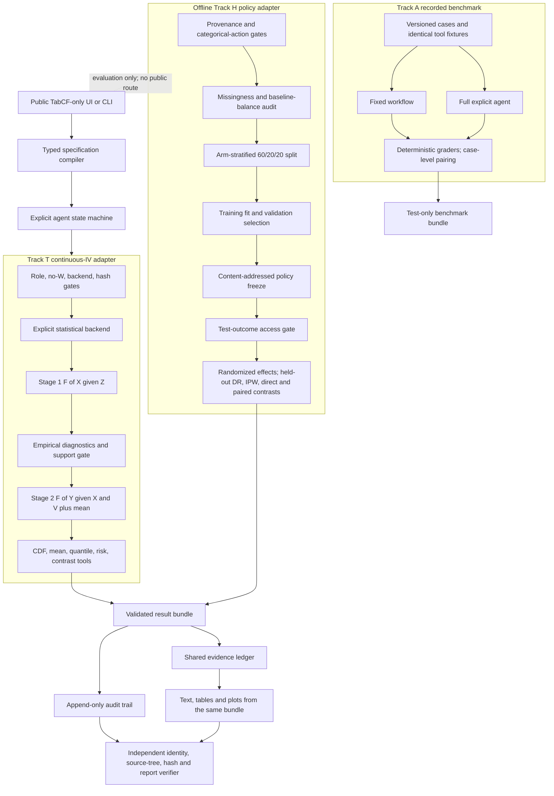
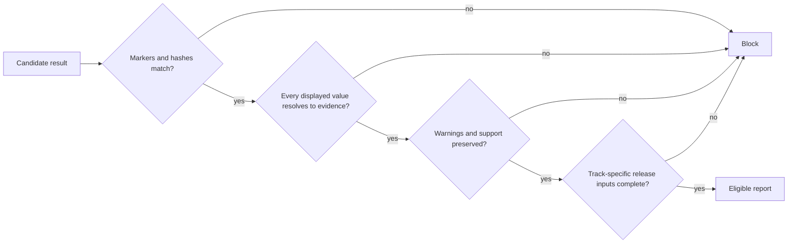

# DCFA architecture and evidence flow

The dotted Hillstrom/UI edge is a prohibition, not a routing option. Numerical
causal calculations remain inside deterministic tools. The state machine may
compile, route, retry once, validate, cache, and explain; it may not calculate a
headline value or silently change the estimator, roles, policy, or evidence
track.

## Fail-closed release path

For Track T, the last gate includes a real TabPFN backend, locked execution,
release-eligible evidence, exact upstream commit, checkpoint hash, and runtime
image digest. For Track H real-RCT output, it includes provenance-complete real
data and a matching policy frozen before test-outcome access.
