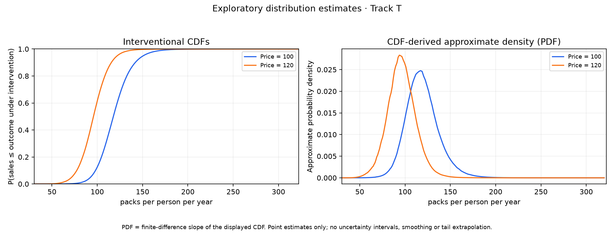

# Agentic TabCF report

<!-- Compact distribution report v1 -->

**Display-only derivative of the saved cigarette run; no new fit or analysis.** The run and evidence identities below belong to the original result. The unchanged original report is [available here](original/run-0001/report.md).

### Distributional analysis — Track T · Exploratory estimates

**Question:** Under the maintained IV assumptions, how does the estimated outcome distribution change from treatment 100 to 120 CPI-deflated cents per pack? All differences are 120 minus 100.

**Sample:** 144 observations. 48 US states in 1985, 1990 and 1995; state-year aggregates with equal weights. Annual cigarette sales per capita (Y), real price (X), real sales tax (Z). Sample details: [data source and preparation](original/SOURCE.md).

**Variables:** Y = `log_packs_per_capita`; X = `log_real_price`; Z = `real_sales_tax`. No baseline covariates.

**Scales:** Model X: stored natural logs (not logged again); model Y: stored natural logs (not logged again). Displayed interventions: CPI-deflated cents per pack; outcome axis, quantiles and quantile changes: packs per person per year. Logged model outcomes are mapped back to original units for display.

**Outcome quantiles**

Levels and changes are in packs per person per year. Each row describes a percentile of the estimated outcome distribution; the median is the 50th percentile. Changes use unrounded estimates, so rounded columns may not subtract exactly. References resolve in the appendix.

| Quantile | At 100 | At 120 | Change (120 − 100) |
|:---|---:|---:|---:|
| 25% | 107.2 [1] | 86.3 [2] | -20.8 [3] |
| 50% | 117.8 [4] | 95.8 [5] | -22.0 [6] |
| 75% | 129.4 [7] | 105.8 [8] | -23.6 [9] |

Technical appendix and evidence index

- Run ID: `run_a59f587b55768ef3b8632887`
- Result bundle: `bundle_d4f43ef6861dd54996886842`
- Specification: `spec_2ab6509e9454758b836df9cf`
- Dataset hash: `sha256:fae33858f487366d0acaaab719b693615cbcca3ecf7de75e67e209c441e9029d`
- Evidence status: `development_only`

**Empirical support and diagnostics**

Support describes empirical coverage, not proof of IV validity or identification. X values and intervals below use the model input scale: stored_natural_log.

- Intervention 100 CPI-deflated cents per pack (model X = 4.60517): **supported**; coverage score 0.9. Inside the strict X interval with adequate local control-rank bin coverage. Strict interval: [4.48694, 4.96363]; recommended interval: [4.4103, 5.0284].
- Intervention 120 CPI-deflated cents per pack (model X = 4.78749): **supported**; coverage score 1. Inside the strict X interval with adequate local control-rank bin coverage. Strict interval: [4.48694, 4.96363]; recommended interval: [4.4103, 5.0284].

| Stored diagnostic | Value |
|---|---:|
| First-stage F | 103.655 |
| First-stage R² | 0.421953 |
| Control-rank CvM | 0.207245 |
| Control-rank mean | 0.472369 |
| Residual-dependence score | 0.00824625 |

**Summary evidence**

| Reference | Query | Validated value | Evidence ID |
|---|---|---|---|
| [1] | `quantile:0.25:0` | 107.155 packs per person per year | `evidence_244cb3ebaa1b9a1bcb782211` |
| [2] | `quantile:0.25:1` | 86.3084 packs per person per year | `evidence_d293e489175b8df36f67eb8d` |
| [3] | `quantile_difference:0.25` | -20.8468 packs per person per year | `evidence_f101c44454f202b1010848f7` |
| [4] | `quantile:0.5:0` | 117.761 packs per person per year | `evidence_11cf2fd495ebdc1b10ab06e3` |
| [5] | `quantile:0.5:1` | 95.8096 packs per person per year | `evidence_4ab574aaf5611b5c9850d73a` |
| [6] | `quantile_difference:0.5` | -21.951 packs per person per year | `evidence_1cc9c859c12c2c8817cc1f75` |
| [7] | `quantile:0.75:0` | 129.399 packs per person per year | `evidence_9ccb7ee9fb9d310485217417` |
| [8] | `quantile:0.75:1` | 105.772 packs per person per year | `evidence_044b399630d14ae582c1481e` |
| [9] | `quantile_difference:0.75` | -23.6268 packs per person per year | `evidence_761f33e2d823881008f4f8f9` |

Complete CDF/PDF grid evidence is in [distribution_results.json](original/run-0001/distribution_results.json): `distribution.curves[].cdf` and `distribution.densities[].pdf` contain query IDs; `evidence[query_id]` contains their values, units, support and evidence IDs. [evidence_records.jsonl](original/run-0001/evidence_records.jsonl) resolves every evidence ID. Full support, diagnostics, raw warning records and assumptions: [result_bundle.json](original/run-0001/result_bundle.json).

### Warning codes

- `DEVELOPMENT_TABPFN_NOT_RELEASE_ELIGIBLE`
- `DISTRIBUTIONAL_POINT_ESTIMATES`
- `POOLED_STATE_YEAR_LIMITATIONS`

<small style="font-size:inherit"><strong>Warnings and interpretation limits</strong><ul><li><strong>Uncertainty and interpretation:</strong> Point estimates only, without confidence intervals or significance. Quantile changes are distributional, not individual effects. CDFs cover only the evaluated outcome grid; no extrapolation.</li><li><strong>Data and model:</strong> Real-data exploratory state-year aggregates with equal observation weights, repeated states, and omitted income and state/year effects. Within-state dependence and omitted confounding are not addressed. One continuous treatment, one continuous outcome, one scalar instrument, and no baseline covariates W.</li><li><strong>IV assumptions:</strong> Relevance, exclusion, instrument exogeneity, scalar monotonicity, and common support are assumptions; empirical diagnostics do not prove instrument validity or identification.</li><li><strong>Density approximation:</strong> The PDF is an approximate density from finite-differencing the displayed CDF grid; it is not separately fitted, smoothed or renormalized. No tail extrapolation is performed; omitted tail mass means its integral over this range need not be one.</li><li><strong>Development status:</strong> Development-only local TabPFN v2 output. The checkpoint artifact is recorded, but the runtime image is not release-locked. Ineligible for locked Track T or release claims.</li></ul></small>

